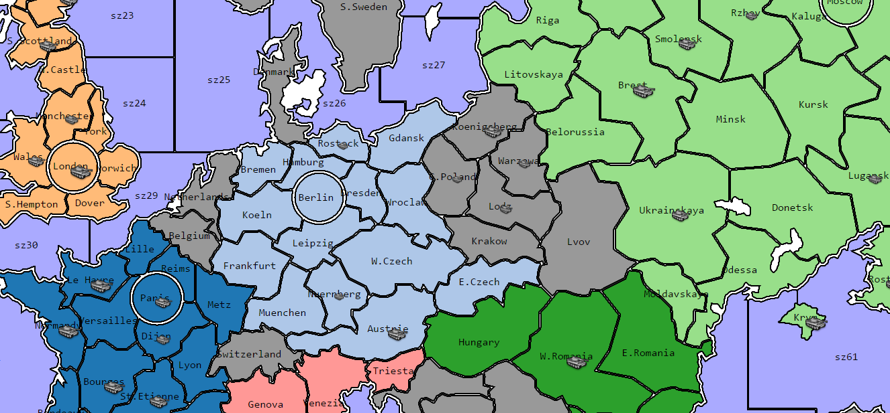

# Area movement wargame model

Anyway, it use some TripleA scenario A New World Order map data.
The Python script handle it to jsonp to load easily.

<a href="https://yiyuezhuo.github.io/Area-Movement-Wargame/">Online demo</a>

I use a small scenario by TripleA for demo to avert a too big file on GitHub.

